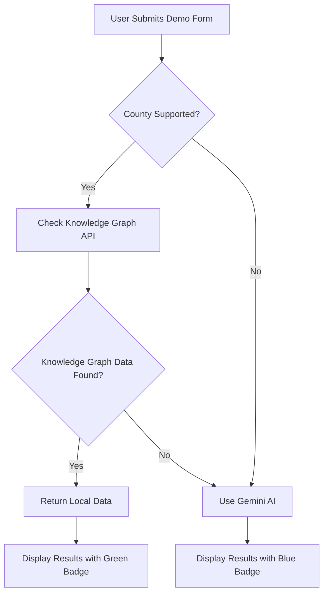

# Demo Page Knowledge Graph Integration

## Overview

The demo page has been enhanced to intelligently use local county knowledge graph data when available, falling back to Gemini AI when county-specific data isn't found. This provides faster, more accurate, and locally-sourced legal information for supported counties.

## Enhanced Functionality

### 🔍 **Smart Data Source Selection**

The demo now follows this intelligent hierarchy:

1. **Primary**: Check for county-specific knowledge graph data
2. **Fallback**: Use Gemini AI for unsupported counties

### 📊 **Supported Counties**

Counties with complete knowledge graph integration:

- ✅ **Alameda County** (`alameda`)
- ✅ **Santa Clara County** (`santa-clara`) 
- ✅ **San Mateo County** (`san-mateo`)

### 🔄 **Data Flow Process**



## Implementation Details

### 🔧 **New API Endpoint**

**Path**: `/api/countyKnowledgeGraph`

**Function**: Checks for county configuration and knowledge graph data, transforms it into the expected format.

**Key Features**:
- Validates county configuration exists
- Reads and parses knowledge graph JSON data
- Transforms knowledge graph nodes into standardized output format
- Provides comprehensive filing requirements based on local court data

### 🎨 **Visual Indicators**

Users can now see the data source:

- 🟢 **Green Badge**: "Knowledge Graph Data" (Local, fast, county-specific)
- 🔵 **Blue Badge**: "AI Generated" (Gemini API fallback)

### 📁 **File Structure**

```
src/
├── app/
│   ├── api/
│   │   ├── countyKnowledgeGraph/
│   │   │   └── route.ts                 # New knowledge graph API
│   │   └── prepareDocket/
│   │       └── route.ts                 # Existing Gemini API
│   └── demo/
│       └── page.tsx                     # Enhanced demo page
├── lib/
│   └── countyKnowledgeGraph.ts          # Utility functions
└── county-rules-scraper/
    ├── county_configs/                  # County configurations
    │   ├── alameda.json
    │   ├── santa-clara.json
    │   └── san-mateo.json
    └── results/knowledge_graphs/        # Knowledge graph data
        ├── alameda_knowledge_graph_cytoscape.json
        ├── santa-clara_knowledge_graph_cytoscape.json
        └── san-mateo_knowledge_graph_cytoscape.json
```

## Data Transformation

### 📝 **Knowledge Graph to Demo Format**

The system intelligently transforms knowledge graph data:

**Input**: Raw knowledge graph nodes with legal document data
**Output**: Structured format matching existing demo expectations

```typescript
interface TransformedData {
  documents: Document[];        // Required filing documents
  conditional: Document[];      // Conditional/optional documents
  rules: Rule[];               // Procedural rules and requirements
  checklist: ChecklistItem[];  // Step-by-step filing checklist
  source: 'knowledge_graph';   // Data source identifier
  county: string;              // County name
  last_updated: string;        // Timestamp
}
```

### 🎯 **Filtering Logic**

The system filters knowledge graph nodes for relevant filing information:

- **High Priority**: `filing_relevance_score > 5`
- **Document Types**: `LOCAL_RULE`, `STANDING_ORDER`, `FORM`
- **Categories**: `Filing Procedures`, procedural requirements
- **Content**: CRC/CCP cross-references, judge-specific procedures

## Benefits

### ⚡ **Performance**
- **Faster responses** for supported counties (no API calls)
- **Reduced API costs** (fewer Gemini calls)
- **Offline capability** for local county data

### 🎯 **Accuracy**
- **Real court data** from actual county websites
- **Current local rules** scraped from official sources
- **Verified procedures** from court documents

### 🔄 **Reliability** 
- **Automatic fallback** to AI when local data unavailable
- **Graceful degradation** for unsupported counties
- **Consistent output format** regardless of data source

## Usage Examples

### ✅ **Supported County (Alameda)**

**Input**: 
```
County: Alameda
Document Type: Motion for Summary Judgment
Judge: Smith
```

**Result**: 
- 🟢 Green "Knowledge Graph Data" badge
- Real Alameda County filing requirements
- Actual local rules and procedures
- Fast response time (~1-2 seconds)

### ❌ **Unsupported County (Los Angeles)**

**Input**:
```
County: Los Angeles  
Document Type: Motion for Summary Judgment
Judge: Johnson
```

**Result**:
- 🔵 Blue "AI Generated" badge  
- Gemini AI-generated requirements
- General California procedures
- Standard response time (~10-15 seconds)

## Adding New Counties

To add support for additional counties:

1. **Add County Configuration**:
   ```bash
   # Create county config file
   county-rules-scraper/county_configs/new-county.json
   ```

2. **Generate Knowledge Graph**:
   ```bash
   cd county-rules-scraper
   node scripts/main.js --county="new-county"
   ```

3. **Update Supported Counties List**:
   ```typescript
   // src/lib/countyKnowledgeGraph.ts
   export const SUPPORTED_COUNTIES = [
     'alameda',
     'santa-clara', 
     'san-mateo',
     'new-county'  // Add here
   ] as const;
   ```

4. **Verify Integration**:
   - Test demo page with new county
   - Confirm green badge appears
   - Validate data quality and relevance

## Future Enhancements

### 🔮 **Planned Features**

1. **Real-time Updates**: Automatic knowledge graph refresh
2. **Judge-Specific Data**: Enhanced judge procedure detection
3. **Cross-County Comparison**: Compare procedures across counties
4. **Quality Metrics**: Data confidence scoring and validation
5. **Cache Management**: Intelligent caching of knowledge graph data

### 📈 **Analytics Integration**

Track usage patterns:
- Knowledge graph vs AI usage ratios
- County-specific request patterns
- Data source performance metrics
- User satisfaction with local vs AI data

## Technical Notes

### 🔒 **Error Handling**

The system includes comprehensive error handling:

- **Missing Config**: Graceful fallback to AI
- **Corrupted Knowledge Graph**: Automatic AI fallback
- **API Failures**: User-friendly error messages
- **Data Validation**: Format verification before display

### 🚀 **Performance Optimization**

- **Lazy Loading**: Knowledge graph data loaded only when needed
- **Memory Management**: Efficient JSON parsing and transformation
- **Response Caching**: Future enhancement for repeated requests

## Conclusion

This enhancement significantly improves the demo page by providing:

- **Faster, more accurate responses** for supported counties
- **Seamless user experience** with automatic fallback
- **Clear visual indicators** of data source
- **Extensible architecture** for adding new counties

The system maintains backward compatibility while adding powerful new capabilities, making it a robust solution for legal filing requirements across California counties. 